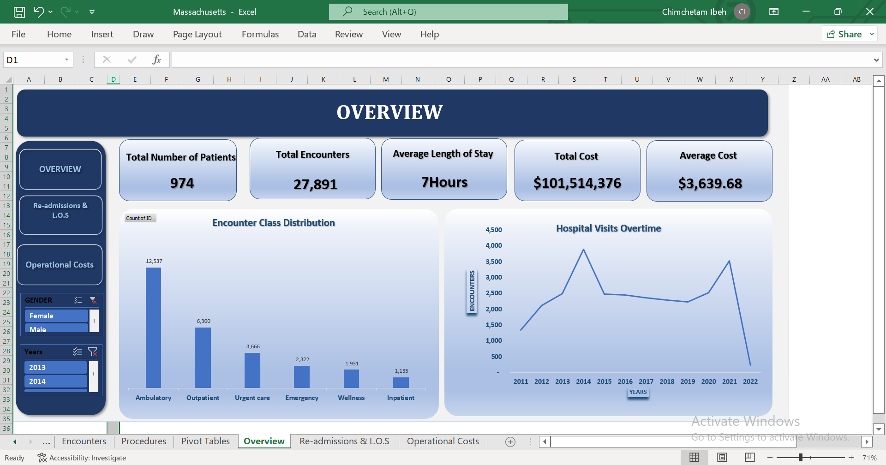

# Massachusetts General Hospital Analysis

## Introduction
In the modern healthcare landscape, understanding patient demographics, encounter types, and cost distributions is vital for improving operational efficiency and patient care outcomes. This project provides a comprehensive analysis of healthcare data from Massachusetts General Hospital using hospital records from year 2011 to 2022  to uncover patterns, and make insightful decisions.

## Project Description
The project covers data collection, cleaning, and structured analysis of hospital records. It involves processing multiple datasets including patient profiles, payer information, clinical encounters, and surgical procedures to address key business and healthcare questions.

## Business Questions
This analysis was guided by the following business questions;
- What is the re-admission rate per 30days? 
- Does insurance coverage affect re-admission rate and Length of stay durations 
within patients with similar diagnosis? 
- What demographic group is associated with longer/shorter stay duration and 
higher re-admission rate? 
- What procedure incurs the most cost post insurance coverage? 
- What department records the highest case of re-admissions? 
- What demographic and operational factors are most strongly associated with 
length of stay above the average for each department? 

## About the Dataset
The analysis is based on the **Massachusetts General Hospital Dataset**, consisting of several interconnected tables:
- **Patients:** Demographic data (ID, Birth Date, Gender, Race, Location).
- **Encounters:** Details on hospital visits (Start/Stop times, Encounter Class, Total Claim Cost, Payer ID).
- **Payers:** Information on insurance providers (Medicare, Medicaid, Dual Eligible, etc.).
- **Procedures:** Data on medical procedures performed and their associated costs.

## Tools Used
- **Microsoft Excel:** Used for initial data exploration, cleaning, and the creation of Pivot Tables and Charts.

## Methodology
- **Standardization:** Ensured "Gender" and "Race" fields followed a consistent naming convention.
- **Date Handling:** Converted Start/Stop times from onverted ISO 8601 format into standard Date/Time formats.
- **Missing Values:** Handled empty fields by labeling them appropriately(eg 'Unspecified,).
  
- Calculated fields were created to determine:
- **Length of Stay:** Difference between Stop and Start times multiplied by 24 to give give answers in hours.
- **Cost Post Payer Coverage:** Difference between Total Claim Cost and Payer Coverage.
- **Re-admission Status:** Categorized based on follow-up encounter patterns.
- **Age:** Yearfraction between Birth date and Death date.
  
- Key metrics analyzed include:
- **Patient Volume:** Total count of unique patients.
- **Financials:** Total Claim Cost and Payer Coverage vs. Out-of-pocket costs.
- **Demographics:** Analysis of patient distribution by City (e.g., Boston, Quincy, Medford) and Gender.
- **Departmental Performance:** Encounter counts by class (Ambulatory, Emergency, Inpatient, Urgent Care, Wellness).

## Data Visualization

- **Re-admissions by Department:** A bar chart showing that Ambulatory and Urgent Care have the highest re-admission counts.
- **Total Cost per Department:** A breakdown of revenue generated across different hospital wings.
- **Payer Distribution:** A pie chart showing the share of claims handled by Medicare, Medicaid, and private payers.
- **Average cost:** per patient was $108,334.
- **Average Patient Age:** 72 years (Range: 26 – 104).
- **Average Length of Stay (LOS):**  7 hours.
- **Total base encounter cost:**  $3,240,421.
- **Insurance Coverage:** 68.42% of encounters were insured while, 31.58% of encounters were "Uninsured."

## Key Insights
-	 Patients with chronic conditions and acute cardiac issues show the strongest correlation with 30-day readmissions.
-  62.51% of the encounters had a 30-Day Re-admission Rate (encounters that occurred within 30 days of a previous discharge).
-  Mortality Rate was 15.81%, indicating a high-acuity patient population (patients with severe conditions).
-  Patients aged 65+ had the highest re-admission rate (64%), representing the hospital’s most vulnerable and resource-intensive segment.
-  Uninsured patients represent a high financial risk, exhibiting the highest readmission rate at 77.1%.
-  Total claim cost was $101,514,376 which was more than 10x higher the base encounter costs.
-  Total payer coverage was $31,097,507, which left a significant uncovered gap of approximately $70 million.

## Recommendations
- **Monthly KPIs:** - Establish monthly tracking system to monitor headline KPIs (Readmission Rate, LOS, and Cost).
- **Geriatric Care:** Create a team dedicated specifically to elderly patients in order to reduce their Re-admission rate.
- **Navigation Team:** Create a team to monitor and follow up patients with three or more unintended visits within 30 days.
- **Financial Optimization:** Help uninsured patients get covered during their first visits to ensure future visits are paid for and reduce uncompensated care losses.

## 13. Conclusion
The insights derived from the Massachusetts General Hospital dataset provide a roadmap for optimizing department-specific resources and improving patient throughput. By addressing re-admission trends, the hospital can enhance both patient satisfaction and financial stability.

## 14. Contact Information
- **Ibeh Chimchetam**
- **LinkedIn:** [www.linkedin.com/in/ibeh-chimchetam]
- **Email:** [ibehchimchetam@gmail.com]
